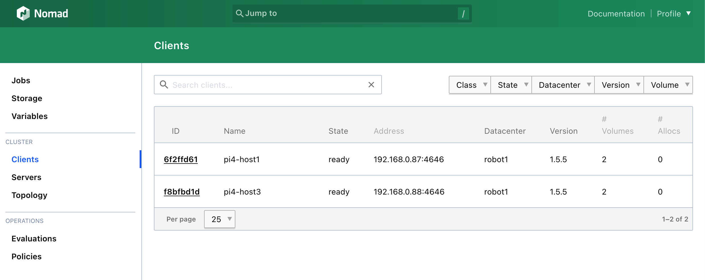
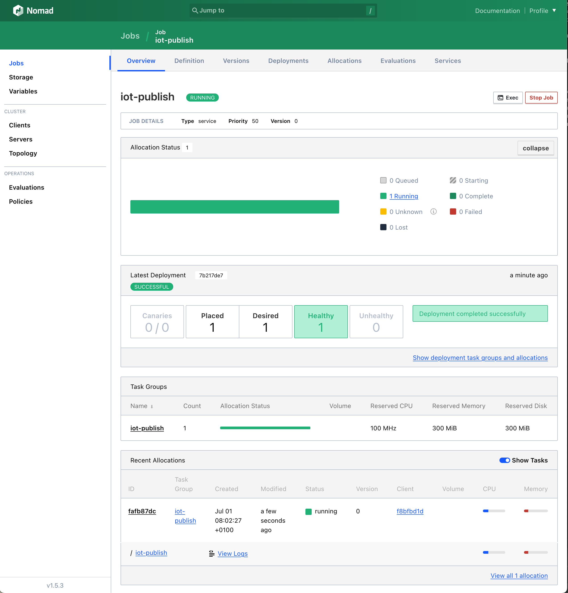
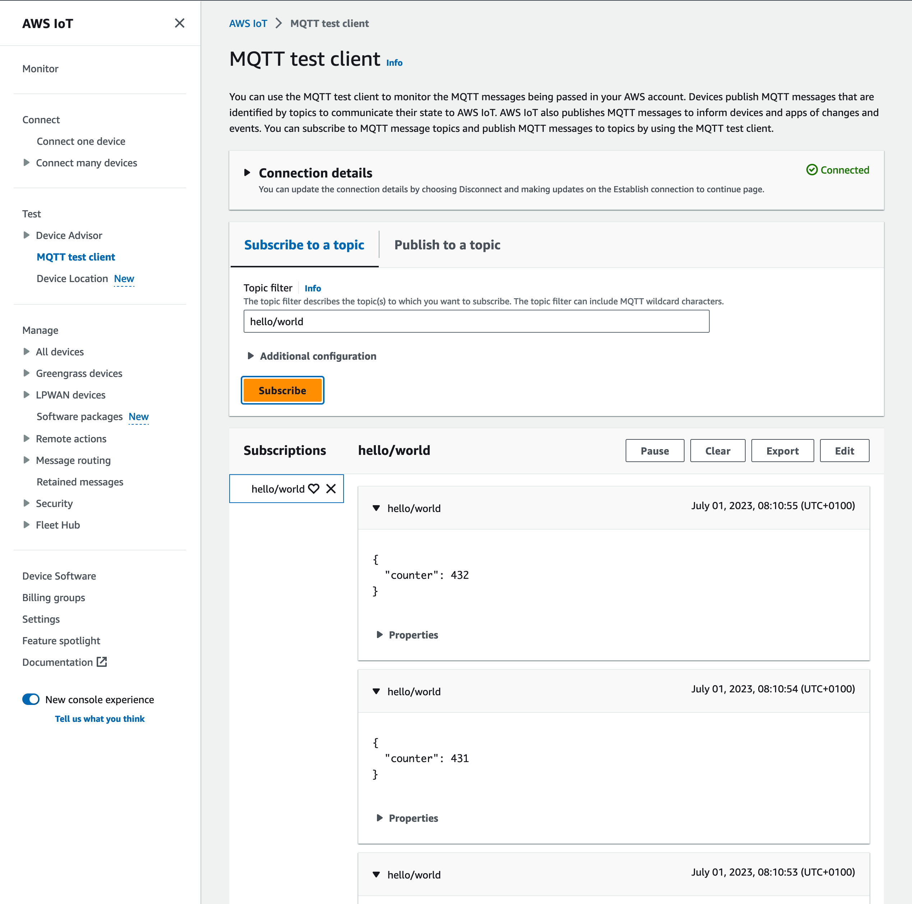
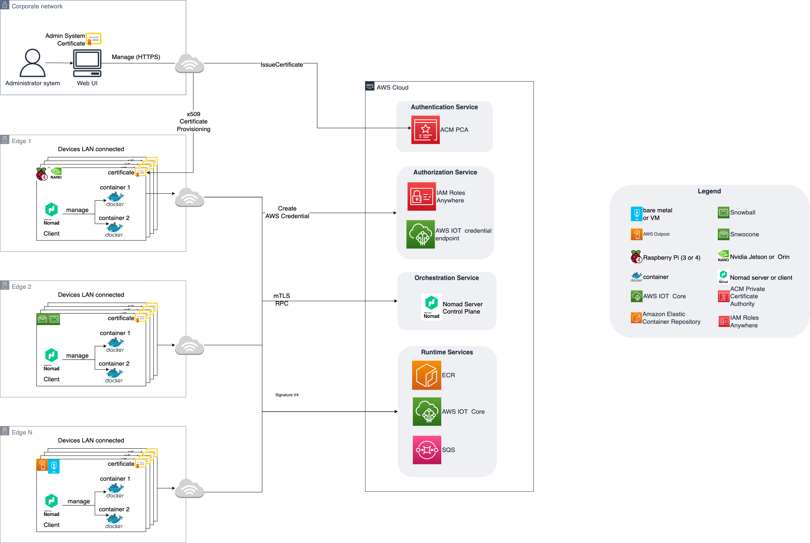
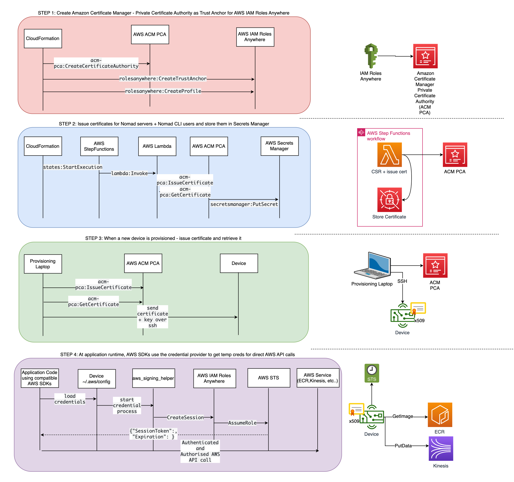

# Container in :robot:

:robot:

## Table of contents
1. [Description](#description)
2. [Getting Started](#getting-started)
3. [Testing the platform](#testing-the-platform)
4. [Architecture](#architecture)
5. [Deep dive at the edge](#deep-dive--at-the-edge)
6. [Troubleshooting](#troubleshooting)
7. [Security](#security)
8. [License](#license)

## Description
The aim of this repository is to deploy a containerized edge native application. Here we focus on architecture:
* edge device are powerful enough to run  container (like raspberry pi 3 or 4)
* the application  needs  to interact with AWS cloud

The proposed architecture relies on three main components:

* **Orchestration infrastructure (Cloud)** based on HashiCorp Nomad. HashiCorp Nomad control plane will be deployed on AWS.

* **Private Certificate Authority** based on AWS Private CA in order to support the different security requirements

* **Credential Provider** based on AWS IAM Roles Anywhere in order to allow the edge native to interact with AWS cloud.


## Getting started
This section is divided in three topics.


The first topic is dedicated to the pre-requisite for running the whole section.


The second topic  focuses on the deployment of the cloud part of the samples: the nomad control plane with all services related to connectivity and security

The last topic focuses on the edge part of the sample: how to connect your edge device to the cloud.

**Warning:** Deploying those stacks will  create resources which are not of the free tier especially a private CA using AWS Private ACM. The pricing can be found here.
### pre-requisite
* The tutorial should be executed on a local workstation, not an on remote workspace such as Cloud9.
* [jq](https://jqlang.github.io/jq/)
* [open](https://ss64.com/osx/open.html) (for MacOS), [xdg-open](https://linux.die.net/man/1/xdg-open) (for Linux)
* [CDK](https://docs.aws.amazon.com/cdk/v2/guide/getting_started.html#getting_started_install)
* [nomad](https://developer.hashicorp.com/nomad/docs/install)
* [docker](https://docs.docker.com/engine/install/)
* [Ansible](https://docs.ansible.com/ansible/latest/installation_guide/intro_installation.html) : Ansible is a tool that provides automation for installing application on your infrastructure at scale.
* the [AWS CLI v2](https://docs.aws.amazon.com/cli/latest/userguide/getting-started-install.html)
* python (at least version 3.7)
* an AWS account
    * AWS credentials with sufficient permission
* the Account and the region should be bootstrapped following official documentation
* at least 1 single board computer such as raspberry pi 3 or 4 or nvidia jetson.
    * your laptop should be able to access your SBC using IP or hostname.
    * you should own a way to connect to your SBC using SSH but without password (like SSH key)
    * `openssh-sftp-server` should be install
        * In /etc/ssh/sshd_conf add Subsystem sftp internal-sftp and restart sshd


### Deploy the cloud infrastructure

Please open a terminal on go at the root of the project:
0. Set up environment variable. Those variables are required so CDK can customize the number of availability zone based on the region it is currently deployed.
    1. `export CDK_DEFAULT_REGION=<your region>`
    2. `export CDK_DEFAULT_ACCOUNT=<your account>`

1. Modify the [Input variables](#input-variables) in [deployment.json](deployment.json) as described below. Especially the `authentication` settings [deployment file](./deployment.json) (`deployment.json`) with your email address and a prefix. The email should be valid as you are going to receive a password from Cognito. The prefix should  be uniq and made of lowercase, alphanumeric character.
2. Install the required npm packages
   ```bash
    npm install
    ```
3. Synthesis the CDK app (translates CDK resources into an AWS CloudFormation template)
   ```bash
    cdk synth
    ```
   You should see the following output:
    ```
    Successfully synthesized to container-in-robot/cdk.out
    Supply a stack id (AcmPcaStack, NomadInfrastructureStack, IamAnyStack) to display its template.
    ```
4. Before deploying the CDK stack we need to authenticate to the ECR public docker repository since we use some of the images in the build.
   ```bash
    aws ecr-public get-login-password --region us-east-1 | docker login --username AWS --password-stdin public.ecr.aws
    ```
       You should see the following output:
    ```
    Login Succeeded
    ```
5. Deploy the `AcmPcaStack`. Note if you already have a PKI infrastructure this is optionals, and you can make modifications to integrate that with the rest of the infrastructure.
   ```bash
    cdk deploy AcmPcaStack
    ```
6. Install the root CA certificate in ACM PCA: https://docs.aws.amazon.com/privateca/latest/userguide/PCACertInstall.html#InstallRoot. At the moment this is a required manual step and should be completed before proceeding.

7. Deploy the `IamAnyStack`.
   ```bash
    cdk deploy IamAnyStack
    
8. Deploy the `NomadInfrastructureStack`.
   ```bash
    cdk deploy NomadInfrastructureStack
    ```
9. To interact with the cluster using nomad in CLI configuration you will need to initialize the following environment variable.
    ```bash
    source ./scripts/set-nomad-env.sh
    ```

#### Input variables

All the input variables are defined in file [deployment.json](deployment.json). Below you can find a detailed explanation:
* `authentication`
    * `username` : the name of the Nomad user, default is `admin`.
    * `email` : the email associated with the Nomad user default. It has to be a valid email address because the password will be sent to this address
    * `domain_prefix` a unique prefix that will be use host the authentication UI of cognito. The prefix should follow [RFC 952](https://datatracker.ietf.org/doc/html/rfc952) requirements
* `cluster`
    * `datacenter_name` : the name of the data center associated with the nomad server, default is `control-plane`.
    * `instance_count` : the number of nomad server in the cluster, default is `3`.
    * `aws_region` : the AWS region where to deploy the cluster.
    * `discovery_tag_key` : the key of  the EC2 instance tag used to discover nomad server in a cluster, default is `nomad-type`.
    * `discovery_tag_value` : the value of  the EC2 instance tag used to discover nomad server in a cluster, default is `server`.
* `certificates` : certificates properties used for mTLS configuration
    * `ca_cert_secret_name`: the name of the secret storing the certificate of the private CA.
    * `server_cert_secret_name` the name of the secret storing the certificate of the nomad server.
    * `server_private_key_secret_name` the name of the secret storing the private key of the nomad server.

#### Output variables
Output variables are stored in SSM Parameter

| Name                                              | Description                                                     |
|---------------------------------------------------|-----------------------------------------------------------------|
| `/infrastructure/nomad/endpoint`                  | DNS of the loadbalancer exposing the Nomad cluster              |
| `/infrastructure/nomad/token/bootstrap`           | token associated with the bootstrap policy of the nomad cluster |
| `/infrastructure/nomad/token/policies/submit-job` | token associated with `submit-job only` policy                  |
| `/infrastructure/pca/arn`                         | the ARN of the private CA                                       |
| `/infrastructure/profile/arn`                     | the ARN of the profile used with IAM Role Anywhere              |
| `/infrastructure/role/arn`                        | the ARN of the role used with IAM Role Anywhere                 |
| `/infrastructure/trust_anchor/arn`                | the ARN of the trust anchor used with IAM Role Anywhere         |

### Connect an edge device to the cloud
Please note that currently this provisioning script has only been tested on a Raspberry Pi 4 installed with Rasberry Pi OS Lite (64-bit). If you have a different target you can modify the ansible scripts to meet your needs.

From the root of this git repository, please run:

1. Update the file ./inventory/inventory.yml with the SBC ssh connection setting.
2. Change directory to the `nomad-client` folder
   ```bash
    cd nomad-client
    ```
3. Create a python virtual environment
   ```bash
    python3 -m venv ./venv
    ```
4. Activate virtual environment:
    ```bash
    source ./venv/bin/activate  
    ```
5. Install dependencies for python script [provisioner.py](./nomad-client/provisioner.py):
    ```bash
    pip install -r requirements.txt
    ```
6. Edit the host names and ssh keys in [inventory.yml](./nomad-client/inventory.yml)
7. Use ping to check the instances are reachable:
    ```bash
    ansible  -i ./inventory/inventory.yml -m ping all
    ```
8. Review and edit the `aws_region` and `profile` in [playbook.yml](./nomad-client/playbook.yml) to match your AWS credentials. Note that the region must match the one you deployed the CDK stack to since the ansible tasks will fetch parameters from AWS SSM Parameter Store to configure the nomad agent.
9. Run the playbook. This will install all the necissary dependencies and provision certificates to the device:
    ```bash
    ansible-playbook -i ./inventory/inventory.yml playbook.yml 
    ```

If the playbook completes successfully, you should now see clients connected to your Nomad cluster in the the ready state.



## Testing the platform
### Deploying a Nomad Job
The Nomad job defines the schema for Nomad jobs: [https://developer.hashicorp.com/nomad/docs/job-specification](https://developer.hashicorp.com/nomad/docs/job-specification)

Either the Nomad CLI or the Nomad GUI can be used to create jobs

### IoT Core publish job

1. Make sure you have the nomad CLI installed on your machine: https://developer.hashicorp.com/nomad/docs/install
2. Authenticate the Nomad CLI
    ```bash
    source scripts/set-nomad-env.sh
    ```
3. Build the docker container locally and push to you ECR repository. Substitute your region and account in the command:
    ```bash
    ./scripts/build-and-publish.sh AWS_REGION AWS_ACCOUNT_ID
    ```
4. Run the nomad job:
    ```bash
    nomad job run -check-index 0 scripts/iot-publish.nomad.hcl
    ```
5. Log into the Nomad UI and check the job status and logs

6. Log into the AWS IoT console and use the MQTT test client to view messages on the `hello/world` topic


Note how we mount the following volumes in the [job](scripts/iot-publish.nomad.hcl) - this is required for boto3 to use the certificate to generate temporary credentials to make AWS Signature Version 4 requests using temporary credentials.

```
        volumes = [
            "/root/aws:/root/.aws",
            "/root/certificates:/root/certificates",
            "/usr/bin:/usr/bin"
        ]
```

Also note that the AWS API requests must be allowed by the `iamRolesAnywhereProfileRole` defined in [iam-any-stack.ts](lib/iam-any-stack.ts). The IoT publish example works because we include the managed policy `AWSIoTDataAccess`.


### Testing disconnection from control plane
We can simulate a disconnected client which has no internet access by using a firewall on the edge decive to block the outbound connections from the edge to the control plane.

1. Find the public IP address of the instances behind the load balancer
    ```bash
    nslookup ....elb.eu-west-1.amazonaws.com
    ```
2. Configure UFW
    ```bash
    apt install ufw
    sudo ufw allow ssh
    sudo ufw deny out to x.x.x.x
    sudo ufw deny out to y.y.y.y
    sudo ufw deny out to z.z.z.z
    sudo ufw enable
    ```
3. Reboot the device, observe that the job restarts even without access to the control plane


## Architecture


### Orchestration infrastructure (Cloud)

Nomad can be used in three different configurations :
* server mode: the control plane of the nomad cluster
* client mode: the data plane of the nomad cluster or worker nodes. Client are managing containers for example
* CLI mode: interact  with the cluster

Whereas the Nomad server will be deployed on the cloud, the client or CLI mode will be deployed at the edge or at the customer premises. This repository only focus on the deployment on the nomad server on AWS.
As nomad client  can be seen as a database application with three requirements:
* nomad server should be deployed as a cluster with an odd number of occurrence between 1 and 9 (1 is not recommended).
* nomad server should communicate over a LAN network
* nomad server should be deployed with a persistent file system

For securing the nomad cluster we use two layers of security: [mTLS and ACL](https://www.nomadproject.io/docs/concepts/security).

### ACM PCA Stack (Cloud)

`AcmPcaStack` creates the ACM PCA certificate authority, and also an AWS stepfunction which is run on deployment to issue a server certificate for the Nomad cluster as well as a CLI certificate.

Please review the main stack at `lib/acm-pca-stack.ts` which contains parameters for the root CA which you may with to change.

AWS Private CA enables creation of private certificate authority (CA) hierarchies, including root and subordinate CAs. We recommend using ACM PCA in production because it ensures the security of the root CA private key. You can issue certificates using an API call rather than retrieving the root CA private key to sign certificates yourself.

Please see pricing here: https://aws.amazon.com/private-ca/pricing/

Full documentation: https://docs.aws.amazon.com/privateca/latest/userguide/PcaWelcome.html

## Tools
The script's directory contains a python script `generate_cert.py`. This is an example of how to use boto3 to issue a certificate from ACM PCA. This script should be integrated into the device provisioning process.

### IAM Role's Anywhere Stack

`IamAnyStack` creates a trust anchor in IAM Role's Anywhere linked to the ACM PCA created in the first stack.

A new feature allowing you to use AWS Identity and Access Management Roles Anywhere to obtain temporary security credentials in IAM for workloads such as servers, containers, and applications that run outside of AWS. This would replace the JITR (Just In Time Registration) workflow in the case you don't wish to use features in AWS IoT.

This feature is well integrated into ACM PCA: https://docs.aws.amazon.com/rolesanywhere/latest/userguide/getting-started.html

In the case you do not wish to only use AWS IoT, it is recommended to consider IAM Role's anywhere as a more generic option. There is the added benefit of the credential provider binary being managed and released by AWS rather than yourselves: https://docs.aws.amazon.com/rolesanywhere/latest/userguide/credential-helper.html

The following shows the AWS config file that sets the helper tool as the credential process:

```
[default]
region=eu-west-1
credential_process = aws_signing_helper credential-process --certificate /root/certificates/device.pem --private-key /root/certificates/device-key.pem --trust-anchor-arn  --profile-arn --role-arn
```

The full credentials process string to put in the credentials file on the device can be found in the CloudFormation outputs for the IamAnyStack under the CredentialsProcessString key. The template file `nomad-client/templates/credentials.j2` takes parameters from the `credentials-process` clause in the `nomad-client/playbook.yml` file.

#### AWS Signing Helper
The `aws_signing_helper` binary can be downloaded from a link in the doc page here below, however they only include x86 binaries at the time of writing (https://github.com/aws/rolesanywhere-credential-helper/releases/tag/v1.0.4). When deploying or ARM64 devices like the raspberry pi, it's necessary to download the source from GitHub [https://github.com/aws/rolesanywhere-credential-helper] and compile it for the target architecture.

A pre-compiled ARM64 bin is available in this repo: [aws_signing_helper](nomad-client/files/credential-process/aws_signing_helper)

### Authentication Flow



## Deep dive  at the edge
### Description
The structure of the repository aims at following Ansible best practices.
* The  folder [inventory](./nomad-client/inventory)  and nested files contains description of the infrastructure. The hosts have to be accessible using SSH with password and/or key pair. Here, we made use only of the key pair. Ansible host description contains much parameter than demonstrate here. Please refer to the documentation if you need to adapt them to your infrastructure.
* The folder [roles](./nomad-client/roles) and nested files define the role and the task to be associated with the role.
* The file [playbook.yml](./nomad-client/playbook.yml)  defining the role to deploy and on which inventory

### Input variables
The playbook take the  following input variable:
* `region`:
    * the AWS region where the secrets are stored.
    * to be set in file [playbook.yml](./nomad-client/playbook.yml) or to be overridden through CLI.
* `aws_profile`:
    * the AWS profile used in order to access the right IAM role or user.
    * to be set in file [playbook.yml](./nomad-client/playbook.yml) or to be overridden through CLI.
* `nomad_version`:
    * the version of nomad client to deploy on each of the boards
    * to be set in file [playbook.yml](./nomad-client/playbook.yml) or to be overridden through CLI.
* `acm_pca_arn`:
    * the Amazon Certificate Manager Private Certificate Authority ARN
* `cluster_url`:
    * the URL of the load balancer of your Nomad control plane
* `iam_any_trust_anchor_arn`:
    * the ARN of the IAM Roles Anywhere trust anchor
* `iam_any_profile_arn`:
    * the ARN of the IAM Roles Anywhere profile
* `iam_any_role_arn`:
    * the ARN of the IAM Roles Anywhere role
* list of machines:
    * the list machine define in yml format (see [doc](https://docs.ansible.com/ansible/latest/user_guide/intro_inventory.html)).
    * the file name has to be passed as a parameter of the deployment. An example of inventory is implemented in file [./inventory/inventory.yml](./nomad-client/inventory/inventory.yml)

### Installed dependencies
The aim of this Ansible playbook is to install a set dependencies for running nomad on the robot. Those Ansible roles have been designed to work only on Debian or Ubuntu based OS.
#### Software
* unzip
* wget
* curl
* [docker](https://docs.docker.com/get-docker/)
* [nomad](https://developer.hashicorp.com/nomad/downloads)
* network CNI
* [credentials-process](https://github.com/aws/rolesanywhere-credential-helper)
* [docker-credential-ecr-login](https://github.com/awslabs/amazon-ecr-credential-helper)

### Artifacts
* Device certificates and keys in  `/root/aws/certificates`
* [Nomad configuration](nomad-client/templates/nomad.hcl.j2) in `/opt/nomad/config`
    * definition of the mTLS authentication
    * definition of docker plugin
        * bind allocated port to localhost: ports are attached to `127.0.0.1` instead of the private IP associated with the local network.

### Docker authentication against a private ECR repository
In order to have docker fully managing the authentication against a private ECR repository, it is required to:
* to configure docker in order to use the ECR credential helper. An example of such configuration can be found here:
    * [configuration file](nomad-client/files/docker/config.json)
    * [deployment example](nomad-client/roles/nomad/tasks/main.yml)
        * task name: `Create  docker config if it does not exist`
* to install the [ECR credential helper for docker](https://github.com/awslabs/amazon-ecr-credential-helper). An example of installation can be found:
    * Ubuntu 18.04: [roles/nomad/tasks/ecr_login_ubuntu_18.yml](nomad-client/roles/nomad/tasks/ecr_login_ubuntu_18.yml)
    * Debian Bullseye: [roles/nomad/tasks/ecr_login_debian.yml](nomad-client/roles/nomad/tasks/ecr_login_debian.yml)

## Troubleshooting

### Fork exec on macOS
If you get this error:
```
objc[55962]: +[__NSCFConstantString initialize] may have been in progress in another thread when fork() was called.
```
Then run:
```
export OBJC_DISABLE_INITIALIZE_FORK_SAFETY=YES
```
Because of this issue: https://github.com/ansible/ansible/issues/76322


## Security

See [CONTRIBUTING](CONTRIBUTING.md#security-issue-notifications) for more information.

## License

This library is licensed under the MIT-0 License. See the LICENSE file.

